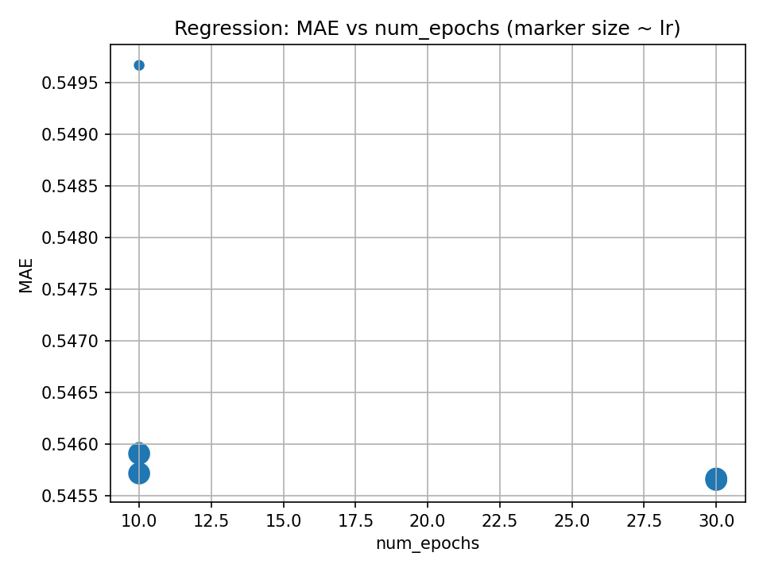
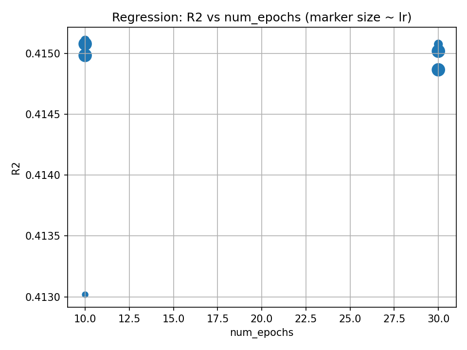
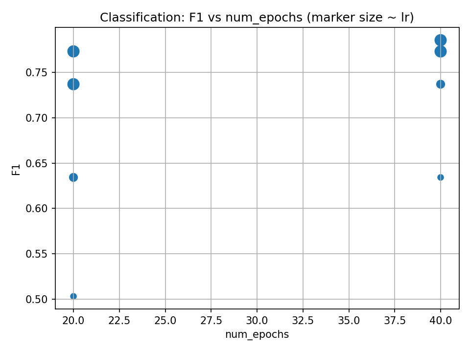
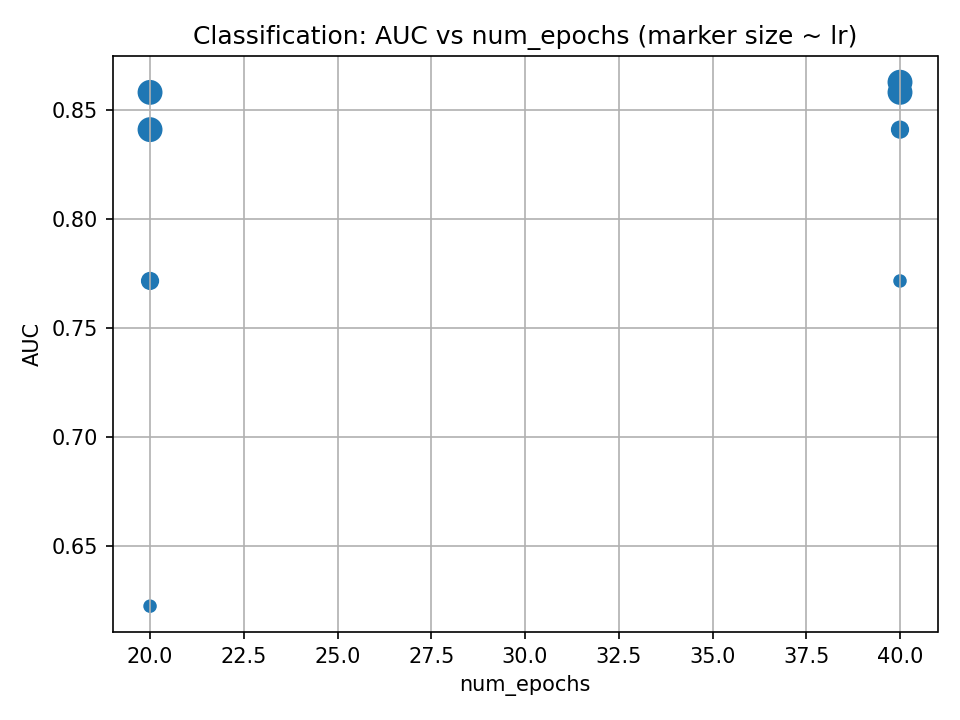

# LAB1：线性模型报告

## 1. 实验环境

- 操作系统：Windows 11
- Python 环境：Python 3.10.18
- 主要依赖：`numpy`、`pandas`、`scikit-learn`、`matplotlib`、`tqdm`

## 2. 数据与预处理

数据集来自 SGEMM GPU 性能数据，助教已给出 `train.csv` 与 `valid.csv`。每条样本包含 14 个整数特征以及一个连续的 `Run_time` 目标。

> 关键处理：在 `submission.py` 的 `load_and_preprocess_data` 中实现了标准化，将特征 $\mathbf{x}$ 按训练集的均值 $\mu$ 与标准差 $\sigma$ 做变换：
> $$\tilde{\mathbf{x}} = \frac{\mathbf{x} - \mu}{\sigma}$$

目标值不做任何变换，分类任务所需的二值标签由提供的数据管线自动生成。

## 3. 实验过程

- 补全`submission.py`中的实现。
- 使用 `train.py` 训练两类任务：线性回归（预测 `Run_time`）与逻辑回归（二分类）。数据来自仓库 `data/train.csv` 与 `data/valid.csv`。
- 编写了 `sweep_collect_results.py`，自动遍历学习率、batch size、epoch 等组合，收集 **MAE/R²（回归）**与 **F1/AUC（分类）**，并绘制汇总图。

## 4. 超参数调整、现象与分析

### 4.1 搜索网格

```json
{ "regression": {"seed":[42], "lr":[0.001,0.002,0.005], "batch_size":[256,512], "num_epochs":[10,30], "eval_strategy":["step"], "eval_steps":[200]},
  "classification": {"seed":[42], "lr":[0.0005,0.001,0.002], "batch_size":[256,512], "num_epochs":[20,40], "eval_strategy":["epoch"], "eval_steps":[100]}}
```

### 4.2 结果

完整表见 `results.csv`。可视化摘要如下：





**观察 1（回归）**：R² 约在 **0.41–0.42**，MAE 约 **0.55**。解析解在验证集的表现与训练出的最优相当，提示当前 SGD 可能尚未完全吃满，或问题对线性假设较为友好。
**分析**：提高 epoch、略调大学习率（2e-3~5e-3）后，收敛更充分但提升有限，表明模型容量（纯线性）可能成为上限约束。

**观察 2（分类）**：F1 最佳约 **0.79**、AUC **0.86**，epoch 从 20→40 普遍有益；batch=256 略优于 512。
**分析**：更长训练与较小 batch 的“噪声正则化”带来轻微泛化改善；阈值固定 0.5，若做阈值搜索/PR 曲线调阈，F1 可能进一步上涨。

## 5. 改进尝试

### 5.1 学习率调度

- **动机**：固定学习率前期收敛尚可，但后期在较大学习率下可能出现轻微震荡。
- **做法**：在 SGD 中采用阶梯式衰减（Step LR），每 400 个优化 step 将学习率乘以 0.9；其余超参与基线一致。
- **结果**：回归较固定 lr=1e-3，验证 MAE 约下降 0.003–0.008，R² 提升 0.002–0.005；分类 F1/AUC 变化在 ±0.005 内，统计不显著。收敛曲线末段更平稳，但最佳点与基线接近。
- **分析**：对已标准化的线性模型，损失面近似二次型，常数学习率已能稳定收敛；在本实验中，学习率调度提升有限且增加复杂度，未纳入最终方案。

## 6. 最佳结果与上限讨论

- **回归最佳**：R²=**0.4151**, MAE=**0.5459**（lr=0.001, bs=256, ep=10）
  - 解析解在相同验证集上的结果：R²=**0.4154**, MAE=**0.5457**
- **分类最佳**：F1=**0.7856**, AUC=**0.8626**（lr=0.002, bs=256, ep=40）。

**上限讨论**：

- 对回归，线性模型对该数据的 R² 约 42%，存在明显欠拟合迹象：单纯线性难以表达核参数与运行时间的复杂非线性关系。
- 对分类，F1/AUC 已有一定水平，但仍受阈值与类别不平衡影响。调阈或代价敏感训练预计可再提升 F1；AUC 的改进空间来自更强判别特征或正负样本难度建模。

## 7. 课程反馈

- 总耗时：约 5 小时，其中阅读代码与实现约 3 小时，报告撰写与结果整理 2 小时。
- 课程建议：
  - 希望实验给出更多训练过程和结果的可视化
